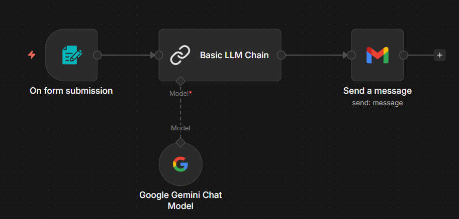
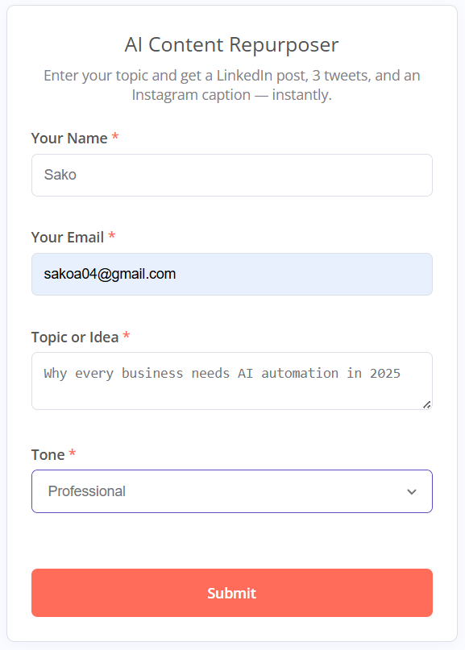
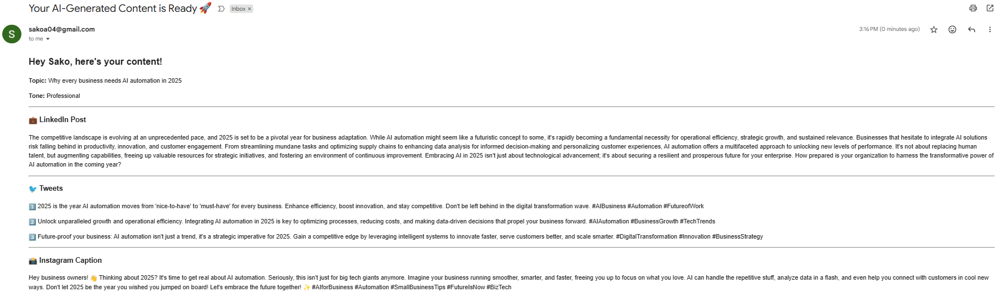

# AI Content Repurposer

Paste a topic → AI generates a LinkedIn post, 3 tweets,
and an Instagram caption → emailed to you instantly.

## Flow

Form submission → Gemini AI generates content → HTML email sent automatically

## Screenshots

### Workflow Canvas

### Form

### Email Output

## Tech Stack

- n8n
- Google Gemini API
- Gmail API

## How to Run

1. Install n8n locally
2. Import `workflow.json`
3. Connect your Google Gemini API key
4. Connect your Gmail account
5. Open the form URL and submit
